# 🚀 Ultimate MDC -  Cursor Rule

> **Tingkatkan produktivitas development Anda hingga 10x lipat dengan kekuatan rule Cursor berbasis AI.**

<div align="center">


**Bahasa:** [🇺🇸 English](README.md) | [🇮🇩 Bahasa Indonesia](README.id.md)

</div>

## 📋 Daftar Isi

- [🌟 Kenapa harus Saya pakai?](#-kenapa-ini-keren)
- [🔧 Isi Koleksi Rule](#-isi-koleksi-rule)
- [🚀 Cara Pakai](#-cara-pakai)
- [📖 Panduan Penggunaan Setiap Rule](#-panduan-penggunaan-setiap-rule)
- [🤖 Kolaborasi dengan Merlin (Model AI)](#-kolaborasi-dengan-merlin-model-ai)
- [💡 Praktik Terbaik & Tips](#-praktik-terbaik--tips)
- [🔄 Contoh Alur Kerja](#-contoh-alur-kerja)
- [🛠️ Panduan untuk Pengguna Mahir](#️-panduan-untuk-pengguna-mahir)
- [📝 Mau Berkontribusi?](#-mau-berkontribusi)

## 🌟 Kenapa harus Saya pakai?

Repositori ini adalah kumpulan **rule Cursor** super canggih yang kami rancang khusus untuk meningkatkan alur kerja development Anda dengan bantuan AI. Setiap rule diciptakan untuk menjadi pemandu cerdas Anda dalam berbagai skenario pengembangan, mulai dari tahap perencanaan produk hingga rilis ke produksi.

### ✨ Keunggulan Utama Rule Ini:

- **🎯 Paham Konteks**: rule mampu beradaptasi dengan kebutuhan unik dan *tech stack* proyek Anda.
- **📏 Skalabilitas Tinggi**: Cocok untuk segala jenis proyek, dari prototipe sederhana hingga aplikasi skala enterprise.
- **🤝 Ramah dengan AI**: Dioptimalkan agar dapat berinteraksi secara mulus dengan model dari Cursor.
- **🏗️ Tidak Terikat Framework**: Kompatibel dengan berbagai teknologi seperti React, Vue, Angular, hingga JavaScript murni.
- **📱 Fokus pada Mobile-First**: Dirancang dengan standar desain responsif dan aksesibilitas sejak awal.

## 🔧 Isi Koleksi Rule

Koleksi rule kami mencakup:

### 1. 📊 **PRD Generator** (`prd-generator.mdc`)
> **Ubah ide menjadi Product Requirements Document (PRD) yang profesional dan terstruktur.**
- Generate PRD lengkap dengan struktur yang benar.
- Mencakup executive summary, user stories, dan success metrics.
- **Trigger**: `prd: [jelaskan ide feature Anda]`

### 2. 🎨 **AI Design System** (`ai-design-system.mdc`) 
> **Ciptakan UI yang konsisten, accessible, dan modern di semua platform.**
- Responsive component yang bisa dipakai di berbagai framework.
- Mengikuti standar accessibility WCAG 2.1 AAA.
- **Trigger**: Otomatis aktif saat Anda meminta bantuan terkait design.

### 3. 🏗️ **Progressive MVP Framework** (`progressive_mvp_framework.mdc`)
> **Bangun product Anda tahap demi tahap, dari konsep hingga rilis ke market.**
- **Level 1**: MVP visual dengan mock data (1-3 hari).
- **Level 2**: Interactive prototype (3-7 hari).
- **Level 3**: Aplikasi full-stack dengan database (5-14 hari).
- **Level 4**: Aplikasi siap production yang teroptimasi (7-21 hari).
- **Level 5**: Solusi siap market yang scalable (14-30 hari).
- **Trigger**: `MVP MODE` atau `LEVEL [1-5]`

### 4. ⚡ **10X Developer Framework** (`unified-10x-dev.mdc`)
> **Terapkan standar development terbaik untuk code quality, security, dan performance tingkat tinggi.**
- Standar code quality dan best practice.
- Pola security dan authentication modern.
- **Trigger**: Selalu aktif, atau gunakan command cepat seperti `FOCUS MODE`.

## 🚀 Cara Pakai

### Installation

1.  **Clone atau unduh** repositori ini.
2.  **Copy semua rule** ke dalam folder `.cursor/rules/` di project Anda:
    ```bash
    mkdir -p .cursor/rules
    cp *.mdc .cursor/rules/
    ```
3.  **Restart Cursor** untuk memuat rule baru.
4.  Saatnya *ngoding* dengan *superpower* dari AI! 🎉

### Verification

Pastikan rule sudah terpasang:
1.  Buka project Anda di Cursor.
2.  Tekan `Cmd/Ctrl + Shift + P`.
3.  Ketik "Cursor Rules" dan pastikan semua rule dari repositori ini muncul di daftar.

## 📖 Panduan Penggunaan Setiap Rule

### 🚀 Menggunakan PRD Generator

**Sangat ideal untuk**: Product Manager, Feature Planning, dan komunikasi dengan *stakeholder*.

```bash
# Generate PRD lengkap untuk sistem autentikasi
prd: sistem autentikasi user dengan social login

# Generate PRD untuk fitur pencarian
prd: fitur search product canggih dengan filter
```

**Apa yang akan Anda peroleh**:
- Dokumen PRD profesional yang mencakup business goals, *user stories*, acceptance criteria, implementation plan, dan success metrics.

### 🎨 Menggunakan Design System

**Sangat ideal untuk**: Membuat UI yang konsisten, accessible, dan responsif.

Rule ini aktif secara otomatis saat Anda meminta bantuan design.

**Contoh prompt**:
```bash
"Buatkan saya component navigasi yang responsif."
"Desain sebuah form login yang accessible dan punya validation."
"Tolong buatkan layout card dengan pendekatan mobile-first."
```

### 🏗️ Menggunakan Progressive MVP Framework

**Sangat ideal untuk**: Membuat prototype cepat, presentasi ke klien, dan development bertahap.

```bash
# Aktifkan MVP mode
MVP MODE

# Mulai dari validasi design
LEVEL 1

# Lanjutkan dengan membuat interactive prototype
LEVEL 2

# Lakukan integrasi dengan database
LEVEL 3
```

### ⚡ Menggunakan 10X Developer Framework

**Sangat ideal untuk**: Menjaga code quality, security, dan performance dalam pekerjaan sehari-hari.

**Command Cepat**:
```bash
FOCUS MODE      # Bekerja lebih fokus tanpa gangguan.
DEBUG MODE      # Lakukan debugging secara sistematis.
OPTIMIZE MODE   # Tingkatkan performance dan refactor code.
SECURE MODE     # Tinjau security dan cari celah vulnerability.
DESIGN MODE     # Perbaiki UI/UX dan pastikan accessibility.
```

## 🤖 Kolaborasi dengan Merlin (Model AI)

### 🎯 Cara Memaksimalkan Kemampuan AI

**1. Beri Konteks yang Jelas**
```bash
# ❌ Kurang Jelas
"Buat sebuah button."

# ✅ Jelas & Rinci
"Buat button CTA utama dengan warna biru, hover state, dan standar accessibility yang sesuai dengan design system kita."
```

**2. Gunakan Trigger yang Tepat**
```bash
# Langsung aktifkan mode yang dibutuhkan
MVP MODE - LEVEL 2
FOCUS MODE
prd: fitur real-time chat
```

**3. Kombinasikan Rule untuk Task yang Lebih Kompleks**
```bash
"Gunakan MVP framework LEVEL 3 untuk membuat admin dashboard, dan pastikan semua component-nya mengikuti standar accessibility dari design system."
```

## 🎨 Merlin Design: Alur Kerja Pembuatan Aplikasi

> **Panduan visual untuk membangun aplikasi dari nol dengan model AI Cursor dan koleksi rule ini.**

```mermaid
flowchart LR
    Mulai([🚀 Mulai]) --> PRD[📋 Buat PRD<br/>prd: ide Anda]
    PRD --> Arsitektur[🏗️ Rancang Arsitektur<br/>FOCUS MODE]
    Arsitektur --> Desain[🎨 Bangun Design System<br/>Warna & Component]
    
    Desain --> L1{🏗️ Level 1<br/>Visual<br/>1-3h}
    L1 --> L1V{✅ Validasi}
    L1V -->|Ulang| L1
    L1V -->|Lanjut| L2{🏗️ Level 2<br/>Interaktif<br/>3-7h}
    
    L2 --> L2V{✅ Validasi}
    L2V -->|Ulang| L2
    L2V -->|Lanjut| L3{🏗️ Level 3<br/>Database<br/>5-14h}
    
    L3 --> L3V{✅ Validasi}
    L3V -->|Ulang| L3
    L3V -->|Lanjut| Keamanan[🔒 Cek Security<br/>SECURE MODE]
    
    Keamanan --> L4{🏗️ Level 4<br/>Production<br/>7-21h}
    L4 --> L4V{✅ Validasi}
    L4V -->|Ulang| L4
    L4V -->|Lanjut| L5{🏗️ Level 5<br/>Market<br/>14-30h}
    
    L5 --> QA[✅ Uji Kualitas<br/>OPTIMIZE MODE]
    QA --> Rilis[🎉 Luncurkan!]
    
    %% Styling
    classDef prdClass fill:#e1f5fe,stroke:#01579b,stroke-width:2px
    classDef designClass fill:#f3e5f5,stroke:#4a148c,stroke-width:2px
    classDef mvpClass fill:#e8f5e8,stroke:#1b5e20,stroke-width:2px
    classDef validationClass fill:#fff3e0,stroke:#e65100,stroke-width:2px
    classDef finalClass fill:#fce4ec,stroke:#880e4f,stroke-width:2px
    
    class PRD,Arsitektur prdClass; class Desain designClass; class L1,L2,L3,L4,L5,Keamanan mvpClass; class L1V,L2V,L3V,L4V validationClass; class QA,Rilis finalClass
```



### 📋 **Daftar Command & Estimasi Waktu**

| Fase | Command Kunci | Tujuan | Estimasi Waktu |
|---|---|---|---|
| **Planning** | `prd: [ide aplikasi]` | Membuat PRD yang jelas | 1-2 jam |
| **Architecture** | `FOCUS MODE` | Merancang fondasi teknis | 2-4 jam |
| **Design** | `DESIGN MODE` | Membangun fondasi UI | 4-8 jam |
| **Level 1** | `MVP MODE - LEVEL 1` | Membuat visual mockup | 1-3 hari |
| **Level 2** | `MVP MODE - LEVEL 2` | Membuat interactive prototype | 3-7 hari |
| **Level 3** | `MVP MODE - LEVEL 3` | Mengintegrasikan database | 5-14 hari |
| **Security** | `SECURE MODE` | Memperkuat security | 2-3 hari |
| **Level 4** | `MVP MODE - LEVEL 4` | Mengoptimalkan untuk production | 7-21 hari |
| **Level 5** | `MVP MODE - LEVEL 5` | Menyiapkan untuk market | 14-30 hari |
| **Final QA** | `OPTIMIZE MODE` | Melakukan pengecekan akhir | 2-5 hari |

## 🚀 **Percepat Development Anda**

### 🔧 **Buat Rule Cursor Anda Sendiri**

Butuh rule yang lebih spesifik untuk project Anda? Jangan khawatir! Anda bisa membuatnya sendiri dengan generator bawaan Cursor:

```bash
# Gunakan command ini untuk membuat rule baru
/generate cursor rules for [jelaskan kebutuhan Anda]

# Contoh:
/generate cursor rules for aplikasi e-commerce
/generate cursor rules for data visualization dashboard
/generate cursor rules for PWA application
```
**Tips Pro**: Gabungkan rule buatan Anda dengan koleksi Ultimate MDC untuk hasil yang lebih dahsyat!

### ⚡ **Rekomendasi *Tech Stack* untuk Pengerjaan Super Cepat**

Pilih framework yang paling Anda kuasai, namun berikut adalah beberapa rekomendasi yang sangat cocok dengan AI workflow:

#### **🎨 CSS Framework**
- **Tailwind CSS**: Paling fleksibel, berbasis utilitas.
- **Bootstrap 5**: Kaya component, sudah teruji di banyak project.
- **Chakra UI**: Pilihan solid untuk aplikasi React.

#### **🏗️ Full-Stack Framework**
- **Next.js (React)**: Pilihan utama untuk aplikasi modern dengan developer experience yang luar biasa.
- **Nuxt.js (Vue)**: Alternatif solid jika Anda lebih suka ekosistem Vue.
- **Laravel (PHP)**: Sangat matang, cepat, dan punya ekosistem yang luas.
- **Django (Python)**: Ideal untuk project yang butuh development backend super cepat.
- **FastAPI (Python)**: Pilihan terbaik untuk membangun API berperforma tinggi.

#### **🎯 Rekomendasi Stack Berdasarkan Use Case**

| Use Case | Rekomendasi Stack | Alasan |
|---|---|---|
| **SaaS Application** | Next.js + Tailwind + Supabase | Full-stack React, styling cepat, backend instan. |
| **E-commerce** | Next.js + Stripe + Prisma | Fitur commerce lengkap, integrasi pembayaran, database aman. |
| **Enterprise Dashboard**| Laravel + Vue.js + Tailwind | Backend tangguh, frontend reaktif, UI profesional. |
| **PWA Mobile-First**| SvelteKit + Tailwind + Firebase| Ringan, responsif, dan punya fitur real-time. |
| **API-First Project**| FastAPI + Postgres + Redis | Performa tinggi, modern, dan skalabel. |

---

**⚡ Ingat**: Framework terbaik adalah yang paling dikuasai oleh tim Anda. Rekomendasi di atas dioptimalkan untuk kecepatan dan kompatibilitas dengan model AI Cursor.

## 💡 Praktik Terbaik & Tips

- **Mulai dari Gambaran Besar**: Gunakan PRD Generator untuk memetakan feature.
- **Utamakan Design**: Terapkan design system sejak awal untuk menjaga konsistensi.
- **Bangun Bertahap**: Manfaatkan level MVP untuk development yang terukur.
- **Jaga Kualitas**: Selalu terapkan standar 10X di setiap tahap.

## 🛠️ Panduan untuk Pengguna Mahir

### 🔗 Menggabungkan Rule

**MVP + Design System**:
```bash
"MVP MODE - LEVEL 2: Bangun aplikasi media sosial yang mengikuti design system kita, pastikan semua component-nya responsif dan accessible."
```

**PRD + Standar 10X**:
```bash  
"Buatkan PRD untuk sistem autentikasi enterprise, lalu bantu saya mengimplementasikannya menggunakan SECURE MODE dengan standar security OAuth 2.0 dan JWT."
```

### 🎛️ Kustomisasi Rule

Anda bisa mengubah perilaku rule dengan mengedit file `.mdc` yang ada di folder `.cursor/rules`.

## 📝 Mau Berkontribusi?

Kami sangat terbuka untuk kontribusi! Jika Anda punya ide untuk membuat koleksi ini lebih baik, jangan ragu untuk:

1.  **Fork** repositori ini.
2.  Buat **feature branch** baru.
3.  Lakukan perubahan dan uji coba.
4.  Kirim **pull request** dengan penjelasan yang detail.

## 📚 Sumber Daya Tambahan

- [Dokumentasi Resmi Cursor](https://cursor.sh/docs)
- [Panduan Format Rule MDC](https://cursor.sh/docs/rules)
- [Panduan Accessibility (WCAG 2.1)](https://www.w3.org/WAI/WCAG21/quickref/)

---

<div align="center">

**🚀 Siap melejitkan development workflow Anda?**

Coba mulai dengan: `prd: [ide brilian Anda berikutnya]`

*Dibuat dengan ❤️ untuk komunitas developer Indonesia.*

</div> 