# 🚀 Ultimate MDC - Advanced Cursor Rules Collection

> **Transform your development workflow with AI-powered Cursor rules for 10X productivity**

<div align="center">


**Languages:** [🇺🇸 English](README.md) | [🇮🇩 Bahasa Indonesia](README.id.md)

</div>

## 📋 Table of Contents

- [🌟 Overview](#-overview)
- [🔧 Rules Collection](#-rules-collection)
- [🚀 Quick Start](#-quick-start)
- [📖 How to Use Each Rule](#-how-to-use-each-rule)
- [🤖 Working with Merlin (AI Assistant)](#working-with-merlin-ai-assistant)
- [💡 Best Practices](#-best-practices)
- [🔄 Workflow Examples](#-workflow-examples)
- [🛠️ Advanced Usage](#-advanced-usage)
- [📝 Contributing](#-contributing)

## 🌟 Overview

This repository contains a powerful collection of **Cursor Rules** designed to supercharge your development workflow with AI assistance. Each rule is crafted to provide intelligent guidance for specific development scenarios, from product requirements to production deployment.

### ✨ What Makes These Rules Special?

- **🎯 Context-Aware**: Rules adapt to your specific project needs and tech stack
- **📏 Scalable**: Works for everything from quick prototypes to enterprise applications
- **🤝 AI-Friendly**: Optimized for seamless interaction with Cursor's AI assistant
- **🏗️ Framework Agnostic**: Compatible with React, Vue, Angular, and vanilla JavaScript
- **📱 Mobile-First**: Built-in responsive design and accessibility standards

## 🔧 Rules Collection

Our comprehensive rule set includes:

### 1. 📊 **PRD Generator** (`prd-generator.mdc`)
> **Professional Product Requirements Documents**
- Generate comprehensive PRDs with proper structure
- Include executive summaries, user stories, and success metrics
- Template-driven approach for consistency
- **Trigger**: Type `prd: [your feature description]`

### 2. 🎨 **AI Design System** (`ai-design-system.mdc`) 
> **Universal Design Framework**
- Cross-framework responsive components
- WCAG 2.1 AAA accessibility standards
- Design tokens and color systems
- Mobile-first responsive breakpoints
- **Trigger**: Design-related requests automatically activate

### 3. 🏗️ **Progressive MVP Framework** (`progressive_mvp_framework.mdc`)
> **From Concept to Production in Stages**
- **Level 1**: Design-only MVP with mockup data (1-3 days)
- **Level 2**: Interactive MVP with client-side logic (3-7 days)  
- **Level 3**: Database-integrated full-stack (5-14 days)
- **Level 4**: Production-ready optimized (7-21 days)
- **Level 5**: Market-ready scalable solution (14-30 days)
- **Trigger**: Type `MVP MODE` or specify `LEVEL [1-5]`

### 4. ⚡ **10X Developer Framework** (`unified-10x-dev.mdc`)
> **Comprehensive Development Excellence**
- Code quality standards and best practices
- Security and authentication patterns
- Performance optimization guidelines
- AI assistance optimization
- **Trigger**: Always active or use quick commands like `FOCUS MODE`

## 🚀 Quick Start

### Installation

1. **Clone or download** this repository
2. **Copy the rules** to your project's `.cursor/rules/` directory:
   ```bash
   mkdir -p .cursor/rules
   cp *.mdc .cursor/rules/
   ```
3. **Restart Cursor** to load the new rules
4. **Start coding** with AI superpowers! 🎉

### Verification

To verify the rules are loaded:
1. Open Cursor in your project
2. Press `Cmd/Ctrl + Shift + P`
3. Type "Cursor Rules" - you should see your rules listed

## 📖 How to Use Each Rule

### 🚀 PRD Generator Usage

**Perfect for**: Product managers, feature planning, stakeholder communication

```bash
# Generate a full PRD
prd: user authentication system

# Generate mobile-focused PRD  
prd: mobile app onboarding flow

# Generate AI feature PRD
prd: AI-powered search functionality
```

**What you'll get**:
- Executive summary with key metrics
- Detailed problem statement and user research insights  
- Goals, objectives, and success criteria
- User stories with acceptance criteria
- Implementation plan with timeline
- Risk assessment and mitigation strategies

### 🎨 Design System Usage

**Perfect for**: Creating consistent, accessible UIs across any framework

The design system automatically activates when you:
- Ask for UI components
- Request responsive layouts
- Need accessibility compliance
- Want consistent styling

**Example prompts**:
```bash
"Create a responsive navigation component"
"Design an accessible form with validation"
"Build a mobile-first card layout"
"Generate a dark mode toggle"
```

**Key features**:
- Universal CSS custom properties
- WCAG 2.1 AAA compliance (7:1 contrast ratio)
- Mobile-first responsive breakpoints (320px, 768px, 1024px, 1440px)
- Cross-framework compatibility
- Semantic HTML structure

### 🏗️ Progressive MVP Framework Usage

**Perfect for**: Rapid prototyping, client presentations, iterative development

```bash
# Activate MVP mode
MVP MODE

# Start with design validation
LEVEL 1

# Add interactivity  
LEVEL 2

# Full database integration
LEVEL 3

# Production optimization
LEVEL 4

# Market-ready scaling
LEVEL 5
```

**Progressive Development Strategy**:

| Level | Focus | Timeline | Output |
|-------|-------|----------|--------|
| **Level 1** | Visual Validation | 1-3 days | Interactive mockups |
| **Level 2** | Behavioral Validation | 3-7 days | Functional prototype |
| **Level 3** | Data Validation | 5-14 days | Full-stack app |
| **Level 4** | Performance Validation | 7-21 days | Production-ready |
| **Level 5** | Market Validation | 14-30 days | Scalable solution |

### ⚡ 10X Developer Framework Usage

**Perfect for**: Daily development, code quality, team collaboration

**Quick Commands**:
```bash
FOCUS MODE      # Eliminate distractions, concentrate on current task
DEBUG MODE      # Systematic debugging with step-by-step analysis
OPTIMIZE MODE   # Performance improvements and refactoring
SECURE MODE     # Security review and vulnerability assessment
DESIGN MODE     # UI/UX improvements and accessibility
```

**Standards Applied**:
- TypeScript/strong typing enforcement
- SOLID principles and functional programming
- Comprehensive error handling
- Security-first authentication patterns
- Performance optimization (sub-3s load times)

## 🤖 Working with Merlin (AI Assistant)

### 🎯 Maximizing AI Effectiveness

**1. Be Specific with Context**
```bash
# ❌ Vague
"Create a button"

# ✅ Specific  
"Create a primary CTA button following the design system with hover states and accessibility compliance"
```

**2. Use Rule-Specific Triggers**
```bash
# Activate specific modes
MVP MODE - LEVEL 2
FOCUS MODE  
prd: real-time chat feature
```

**3. Combine Rules for Complex Tasks**
```bash
"Using the MVP framework LEVEL 3, create a user dashboard following the design system accessibility standards"
```

### 🔄 Iterative Development Flow

1. **Start with PRD** → Define requirements clearly
2. **Apply Design System** → Create consistent, accessible UI
3. **Use MVP Levels** → Build progressively from design to production
4. **Apply 10X Standards** → Maintain code quality throughout

### 💬 Effective AI Prompts

**For PRD Generation**:
```bash
"prd: social media scheduling tool for small businesses with analytics dashboard"
```

**For MVP Development**:
```bash  
"MVP MODE - LEVEL 1: Create a task management app with kanban board, user authentication, and team collaboration features"
```

**For Design System Implementation**:
```bash
"Create a responsive e-commerce product grid using the design system with filtering, sorting, and mobile optimization"
```

## 💡 Best Practices

### 🎯 Rule Activation Strategy

1. **Start High-Level** → Use PRD generator for feature planning
2. **Design First** → Apply design system for UI consistency  
3. **Build Progressively** → Use MVP levels for incremental development
4. **Maintain Quality** → Apply 10X standards throughout

### 🔧 Development Workflow

```mermaid
graph TD
    A[📋 PRD Generation] --> B[🎨 Design System]
    B --> C[🏗️ MVP Level 1-2]
    C --> D[⚡ 10X Standards]
    D --> E[🏗️ MVP Level 3-5]
    E --> F[🚀 Production Ready]
```



## 🎨 Merlin Design: Step-by-Step App Creation Flow

> **Complete visual guide for building applications with Merlin AI and Cursor rules**

```mermaid
flowchart LR
    Start([🚀 Start]) --> PRD[📋 PRD<br/>prd: your idea]
    PRD --> Arch[🏗️ Architecture<br/>FOCUS MODE]
    Arch --> Design[🎨 Design System<br/>Colors & Components]
    
    Design --> L1{🏗️ Level 1<br/>Visual<br/>1-3d}
    L1 --> L1V{✅ Valid?}
    L1V -->|No| L1
    L1V -->|Yes| L2{🏗️ Level 2<br/>Interactive<br/>3-7d}
    
    L2 --> L2V{✅ Valid?}
    L2V -->|No| L2
    L2V -->|Yes| L3{🏗️ Level 3<br/>Database<br/>5-14d}
    
    L3 --> L3V{✅ Valid?}
    L3V -->|No| L3
    L3V -->|Yes| Security[🔒 Security<br/>SECURE MODE]
    
    Security --> L4{🏗️ Level 4<br/>Production<br/>7-21d}
    L4 --> L4V{✅ Valid?}
    L4V -->|No| L4
    L4V -->|Yes| L5{🏗️ Level 5<br/>Market<br/>14-30d}
    
    L5 --> Final[✅ QA<br/>OPTIMIZE MODE]
    Final --> Deploy[🎉 Launch!]
    
    %% Quick Commands (positioned above main flow)
    QFocus[⚡ FOCUS MODE] -.-> L1
    QDebug[🐛 DEBUG MODE] -.-> L2
    QSecure[🔒 SECURE MODE] -.-> Security
    QOptimize[📈 OPTIMIZE MODE] -.-> L4
    QDesign[🎨 DESIGN MODE] -.-> Design
    
    %% Styling
    classDef prdClass fill:#e1f5fe,stroke:#01579b,stroke-width:2px
    classDef designClass fill:#f3e5f5,stroke:#4a148c,stroke-width:2px
    classDef mvpClass fill:#e8f5e8,stroke:#1b5e20,stroke-width:2px
    classDef validationClass fill:#fff3e0,stroke:#e65100,stroke-width:2px
    classDef finalClass fill:#fce4ec,stroke:#880e4f,stroke-width:2px
    classDef quickClass fill:#f1f8e9,stroke:#33691e,stroke-width:1px,stroke-dasharray: 5 5
    
    class PRD,Arch prdClass
    class Design designClass
    class L1,L2,L3,L4,L5,Security mvpClass
    class L1V,L2V,L3V,L4V validationClass
    class Final,Deploy finalClass
    class QFocus,QDebug,QOptimize,QSecure,QDesign quickClass
```



### 📋 **Merlin Commands Reference**

| Phase | Command | Purpose | Expected Timeline |
|-------|---------|---------|-------------------|
| **Planning** | `prd: [your app idea]` | Generate comprehensive PRD | 1-2 hours |
| **Architecture** | `FOCUS MODE: Recommend tech stack for [app type]` | Technical planning | 2-4 hours |
| **Design** | `Create design system for [app type]` | UI foundation | 4-8 hours |
| **Level 1** | `MVP MODE - LEVEL 1: [app description]` | Visual mockup | 1-3 days |
| **Level 2** | `MVP MODE - LEVEL 2: Add interactivity` | Interactive prototype | 3-7 days |
| **Level 3** | `MVP MODE - LEVEL 3: Full-stack implementation` | Database integration | 5-14 days |
| **Security** | `SECURE MODE: Security review and hardening` | Security implementation | 2-3 days |
| **Level 4** | `MVP MODE - LEVEL 4: Production optimization` | Performance & reliability | 7-21 days |
| **Level 5** | `MVP MODE - LEVEL 5: Market-ready scaling` | Scalability & market prep | 14-30 days |
| **Final QA** | `OPTIMIZE MODE: Final testing and documentation` | Quality assurance | 2-5 days |

### 🔄 **Quick Commands During Development**

Use these commands at any stage for immediate assistance:

```bash
FOCUS MODE      # Eliminate distractions, concentrate on current task
DEBUG MODE      # Systematic debugging with step-by-step analysis  
OPTIMIZE MODE   # Performance improvements and refactoring
SECURE MODE     # Security review and vulnerability assessment
DESIGN MODE     # UI/UX improvements and accessibility compliance
```

### 🎯 **Validation Checkpoints**

Each level includes specific validation criteria:

- **Level 1**: ✅ Visual appeal, responsive design, user flow validation
- **Level 2**: ✅ Interactive functionality, form handling, navigation
- **Level 3**: ✅ Data persistence, API functionality, authentication
- **Level 4**: ✅ Performance benchmarks, error handling, monitoring
- **Level 5**: ✅ Scalability testing, market readiness, compliance

## 🚀 **Supercharge Your Development**

### 🔧 **Generate More Cursor Rules**

Want even more specialized rules for your specific needs? Use Cursor's built-in rule generator:

```bash
# Generate custom rules for your domain
/generate cursor rules for [your specific need]

# Examples:
/generate cursor rules for e-commerce applications
/generate cursor rules for data visualization dashboards  
/generate cursor rules for mobile-first PWA development
/generate cursor rules for AI/ML model integration
/generate cursor rules for blockchain applications
```

**Pro Tip**: Combine generated rules with the existing Ultimate MDC collection for maximum productivity!

### ⚡ **Recommended Tech Stack for Maximum Speed**

#### **🎨 CSS Frameworks** (Choose one for rapid UI development)
```bash
# Modern CSS Frameworks - Pick your favorite:
Tailwind CSS     # Utility-first, highly customizable
Bootstrap 5      # Component-rich, battle-tested
Bulma           # Modern CSS framework without JS
Chakra UI       # React component library
Material-UI     # Google's Material Design for React
Ant Design      # Enterprise-class UI design language
```

#### **🏗️ Full-Stack Frameworks** (Choose based on your preferred language)

**Frontend Frameworks:**
```bash
Next.js         # React-based, full-stack, great DX
Nuxt.js         # Vue.js-based, universal apps
SvelteKit       # Svelte-based, lightweight & fast
Remix           # React-based, focused on web standards
Gatsby          # React-based, static site generation
```

**Backend Frameworks:**
```bash
# Node.js Ecosystem
Express.js      # Minimal and flexible
Fastify         # Fast and low overhead
NestJS          # Angular-inspired, TypeScript-first

# Python Ecosystem  
Django          # Batteries included, rapid development
FastAPI         # Modern, fast, API-focused
Flask           # Lightweight and flexible

# PHP Ecosystem
Laravel         # Elegant syntax, powerful features
Symfony         # Professional PHP framework

# Other Languages
Ruby on Rails   # Convention over configuration
ASP.NET Core    # Cross-platform .NET framework
Spring Boot     # Java-based, enterprise-ready
```

#### **🎯 Framework Recommendations by Use Case:**

| Use Case | Recommended Stack | Why? |
|----------|------------------|------|
| **SaaS Application** | Next.js + Tailwind + Supabase | Full-stack React, rapid styling, instant backend |
| **E-commerce** | Next.js + Stripe + Prisma | Commerce features, payment integration, type-safe DB |
| **Enterprise Dashboard** | Laravel + Vue.js + Tailwind | Robust backend, reactive frontend, professional UI |
| **Mobile-First PWA** | SvelteKit + Tailwind + Firebase | Lightweight, responsive, real-time features |
| **API-First Project** | FastAPI + Postgres + Redis | High performance, modern Python, scalable caching |
| **Content Management** | Django + React + Tailwind | Admin interface, content modeling, flexible frontend |

### 💡 **Quick Setup Commands with Merlin**

```bash
# Setup with recommended stacks
"FOCUS MODE: Set up a Next.js project with Tailwind CSS and TypeScript"

"MVP MODE - LEVEL 1: Create a Laravel API with Vue.js frontend using Tailwind"

"DESIGN MODE: Generate a complete component library using Chakra UI"

"prd: SaaS dashboard with Django backend and React frontend"
```

### 🔥 **Speed Development Tips:**

1. **Start with Templates**: Use framework starter templates
2. **Component Libraries**: Leverage pre-built UI components  
3. **API Tools**: Use Postman/Insomnia for API testing
4. **Database Tools**: Prisma, Eloquent, or Django ORM for type-safe queries
5. **Authentication**: NextAuth.js, Laravel Sanctum, or Django Allauth
6. **Deployment**: Vercel, Netlify, or Railway for instant deployment

---

**⚡ Remember**: The best framework is the one your team knows well. These recommendations optimize for speed and Merlin AI compatibility!

### 📊 Quality Checkpoints

- **Level 1**: Visual appeal and user flow validation
- **Level 2**: Interactive functionality and usability
- **Level 3**: Data persistence and business logic
- **Level 4**: Performance optimization and monitoring
- **Level 5**: Security hardening and scalability

## 🔄 Workflow Examples

### 🌟 Example 1: E-commerce Product Feature

```bash
# 1. Define requirements
prd: product recommendation engine with ML-based suggestions

# 2. Start with visual design
MVP MODE - LEVEL 1

# 3. Add interactivity  
LEVEL 2

# 4. Integrate with database
LEVEL 3

# 5. Optimize for production
LEVEL 4
```

### 🌟 Example 2: SaaS Dashboard

```bash
# 1. Apply design system for consistency
"Create a responsive admin dashboard with sidebar navigation, data visualization components, and user management interface"

# 2. Use 10X standards
FOCUS MODE

# 3. Implement security
SECURE MODE
```

## 🛠️ Advanced Usage

### 🔗 Rule Combinations

**MVP + Design System**:
```bash
"MVP MODE - LEVEL 2: Build a social media app following the design system with responsive cards, accessibility compliance, and interactive features"
```

**PRD + 10X Standards**:
```bash  
"Generate a PRD for enterprise authentication system, then implement using SECURE MODE with OAuth 2.0 and JWT best practices"
```

### 🎛️ Customization

You can modify rules by editing the `.mdc` files:

1. **Adjust design tokens** in `ai-design-system.mdc`
2. **Modify MVP timelines** in `progressive_mvp_framework.mdc`  
3. **Add custom PRD sections** in `prd-generator.mdc`
4. **Update coding standards** in `unified-10x-dev.mdc`

### 📈 Scaling for Teams

- **Consistent Standards**: All team members use the same design system
- **Progressive Development**: Clear milestones with MVP levels
- **Quality Gates**: 10X standards enforce code quality
- **Documentation**: PRD generator ensures clear requirements

## 🤝 Contributing

We welcome contributions to improve these rules!

### 📝 Guidelines

1. **Follow the MDC format** with proper metadata
2. **Test thoroughly** with various project types
3. **Document changes** with clear examples
4. **Maintain backward compatibility**

### 🔄 Submitting Changes

1. Fork the repository
2. Create a feature branch  
3. Test your rule modifications
4. Submit a pull request with detailed description

## 📚 Resources

- [Cursor Documentation](https://cursor.sh/docs)
- [MDC Rule Format Guide](https://cursor.sh/docs/rules)
- [Accessibility Guidelines (WCAG 2.1)](https://www.w3.org/WAI/WCAG21/quickref/)
- [Progressive Enhancement](https://developer.mozilla.org/en-US/docs/Glossary/Progressive_Enhancement)

---

<div align="center">

**🚀 Ready to 10X your development workflow?**

Start by trying: `prd: your next amazing feature`

*Built with ❤️ for the developer community*

</div> 